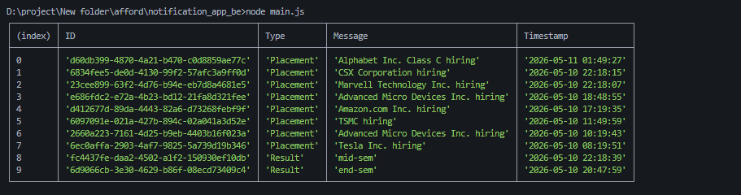

# Stage 1

Campus notification system for placements, events and results.

Users are already authorised, so no login API is needed.

## Notification JSON

```json
{
  "id": "1",
  "title": "Placement Drive",
  "message": "ABC company drive starts tomorrow",
  "type": "placement",
  "isRead": false,
  "createdAt": "2026-05-11T10:00:00Z"
}
```

## APIs

Create notification:

```http
POST /api/notifications
```

```json
{
  "title": "Exam Result",
  "message": "Semester results are published",
  "type": "result"
}
```

Get all notifications:

```http
GET /api/notifications
```

Get one notification:

```http
GET /api/notifications/:id
```

Mark as read:

```http
PATCH /api/notifications/:id/read
```

Delete notification:

```http
DELETE /api/notifications/:id
```

## Common Response

```json
{
  "success": true,
  "data": {}
}
```

## Error Response

```json
{
  "success": false,
  "message": "Notification not found"
}
```

## Real-Time Notifications

Use WebSocket for live updates:

```http
GET /ws/notifications
```

Example event:

```json
{
  "event": "new_notification",
  "data": {
    "id": "1",
    "title": "Placement Drive",
    "message": "ABC company drive starts tomorrow"
  }
}
```

If WebSocket fails, frontend can call `GET /api/notifications` every 30 seconds.

# Stage 2

I will use Neon PostgreSQL with Drizzle ORM.

Reason ->

- PostgreSQL is reliable for structured notification data.
- Neon gives hosted serverless Postgres, so setup is fast.
- Drizzle ORM keeps schema and queries type-safe in JavaScript/TypeScript.

## DB Schema

```sql
CREATE TABLE notifications (
  id SERIAL PRIMARY KEY,
  title VARCHAR(100) NOT NULL,
  message TEXT NOT NULL,
  type VARCHAR(30) NOT NULL,
  created_at TIMESTAMP DEFAULT CURRENT_TIMESTAMP
);

CREATE TABLE user_notifications (
  id SERIAL PRIMARY KEY,
  user_id VARCHAR(50) NOT NULL,
  notification_id INT REFERENCES notifications(id),
  is_read BOOLEAN DEFAULT false
);
```

## Drizzle Schema

```ts
export const notifications = pgTable("notifications", {
  id: serial("id").primaryKey(),
  title: varchar("title", { length: 100 }).notNull(),
  message: text("message").notNull(),
  type: varchar("type", { length: 30 }).notNull(),
  createdAt: timestamp("created_at").defaultNow()
});

export const userNotifications = pgTable("user_notifications", {
  id: serial("id").primaryKey(),
  userId: varchar("user_id", { length: 50 }).notNull(),
  notificationId: integer("notification_id").references(() => notifications.id),
  isRead: boolean("is_read").default(false)
});
```

## Queries

Create notification:

```sql
INSERT INTO notifications (title, message, type)
VALUES ('Exam Result', 'Semester results are published', 'result');
```

Get all notifications for a user:

```sql
SELECT n.*, un.is_read
FROM notifications n
JOIN user_notifications un ON n.id = un.notification_id
WHERE un.user_id = 'user_1'
ORDER BY n.created_at DESC;
```

Get one notification:

```sql
SELECT n.*, un.is_read
FROM notifications n
JOIN user_notifications un ON n.id = un.notification_id
WHERE n.id = 1 AND un.user_id = 'user_1';
```

Mark as read:

```sql
UPDATE user_notifications
SET is_read = true
WHERE notification_id = 1 AND user_id = 'user_1';
```

Delete from user inbox:

```sql
DELETE FROM user_notifications
WHERE notification_id = 1 AND user_id = 'user_1';
```

## Problems When Data Grows

- Many notifications can make list APIs slow. Use indexes on `user_id`, `notification_id`, and `created_at`.
- Old notifications can increase table size. Archive or delete old records.
- Too many real-time connections can overload one server. Use WebSocket scaling with pub/sub later.
- Large result sets can slow frontend loading. Use pagination with `limit` and `offset`.

# Stage 3

Given slow query:

```sql
SELECT *
FROM notifications
WHERE studentID = 1042 AND isRead = false
ORDER BY createdAt ASC;
```

This query is not a great query 

Problems- >
- Column names should be consistent, like `student_id`, `is_read`, `created_at`.
- `SELECT *` fetches unnecessary columns.
- `ORDER BY createdAt ASC` shows oldest unread first. Usually latest notifications should come first.
- With 5,000,000 notifications, this is slow without a proper index.

We can  query like this->

```sql
SELECT id, title, message, notification_type, created_at
FROM notifications
WHERE student_id = 1042 AND is_read = false
ORDER BY created_at DESC
LIMIT 20;
```

and for index we can try like this:

```sql
CREATE INDEX idx_student_unread_created
ON notifications (student_id, is_read, created_at DESC);
```

Time complexity worst case would be ->

- Without index: database may scan many rows, close to `O(n)`.
- With index: database can directly find unread notifications for one student, close to `O(log n + limit)`. (index usess b- tree / binary search )

Adding indexes on every column is not good. as it could ->

- Indexes need extra storage
- Inserts and updates become slower
- Unused indexes waste memory and maintenance time.
- Indexes should match real query patterns, not every column.

Find all students who got placement notifications in the last 7 days -

```sql
SELECT DISTINCT student_id
FROM notifications
WHERE notification_type = 'Placement'
  AND created_at >= NOW() - INTERVAL '7 days';
```

index would be ->

```sql
CREATE INDEX idx_type_created_student
ON notifications (notification_type, created_at DESC, student_id);
```

# Stage 4

 notifications are retrieved on each page load, x number of students, so lots of duplicate reads in the database.

improvements ->

## 1. Cache notifications

Implement a Redis or in-memory cache for the counts of messages not read and the latest messages it helps.
- Minimizes multiple database reads.
- Quicker response from pupils.

## 2. Use pagination

Don't pull down all of the notifications.

```http
GET /api/notifications?limit=20&offset=0
```

it could help in 
- Less data transferred.
- Faster frontend loading.
## 3. Only get the number of unread messages first.

When the page is loaded, only fetch the count.

```sql
SELECT COUNT(*)
FROM notifications
WHERE student_id = 1042 AND is_read = false;
```
it help in 
- Smaller query.
- Full list can be loaded only when user opens notifications.

## 4. New notifications will be sent using WebSocket.

New notifications can be pushed live from backend without the need for frontend to repeatedly fetch.

Benefits -> 
- Reduces polling.
Improved real-time user experience.

proble can be 
It is more difficult to scale WebSocket.
- Needs reconnect handling.

## 5. Continue to poll as a fallback.

Use a polling loop instead of polling each time you load a page, if WebSocket is not successful.
so that ->
- Easy and dependable fall-back.

but
Still applies an intermittent load but less than fetching does when the page loads.

Best approach would be to 
- Optimize with DB queries.
- Unread count/recent notifications in the cache.
- Use pagination.
Use Web Socket for real-time updates.
Polling should be used as a last resort.


# Stage 5
Given implementation ->

```js
for student_id in student_ids:
    send_email(student_id, message)
    save_to_db(student_id, message)
    push_to_app(student_id, message)
```

Problems->
An incorrect e-mail may halt or stall the entire process.
Excessive email/API calls for a single request - 50,000 students.
In case of email success and failure to save to DB, data is inconsistent.
Save DB successful, email failed – retry is difficult without a track of status.
- HR will wait for too long the API's response.

Now assume that 200 students attempted to use email, and that they lost their access to it midway through:

Do not repeat all of the above.
Remove deliveries that have failed, and the status 'failed'.
- Only retest 200 students.
If it fails we use `logging_middleware` to log the failure.

Or better approch would be - >
If it has already been saved to the DB, then save it again.
Add Status of Student Delivery rows which are pending.
- Place delivery orders in a queue.
Delivers push notification and email in background (worker processes).
- Make each row sent or failed.
- Retry failed jobs.

Don't make a single request for DB and email at the same time.

because 
The DB save will be quick and you will be able to test that a notification is created.
Email is slow, and may fail due to external API problems.
Background jobs make the system more faster than normal and more reliable.

Revised pseudocode:

```js
function notify_all(student_ids, message):
    notification_id = save_notification(message)

    for student_id in student_ids:
        save_delivery(notification_id, student_id, status="pending")
        add_to_queue("send_notification", notification_id, student_id)

    return "Notification accepted"

worker send_notification_job(notification_id, student_id):
    try:
        send_email(student_id, notification_id)
        push_to_app(student_id, notification_id)
        update_delivery_status(notification_id, student_id, "sent")
    except error:
        update_delivery_status(notification_id, student_id, "failed")
        retry_job(notification_id, student_id)
```

This implies that HR actions are carried out very fast, the API creating only records and enlisting jobs. Normal delivery will be performed in the background and it will work fine

# Stage 6

Priority Inbox code is in:

```txt
notification_app_be/main.js
```

Approach:

- Fetch notifications from given API.
- Give weight: `Placement = 3`, `Result = 2`, `Event = 1`.
- Use a max heap by score.
- Show top 10.

For new notifications:

- Push new notification into max heap.
- Pop top 10 whenever Priority Inbox is needed.
- This is better than sorting the full list every time.

Logging:

- The script logs when fetching starts.
- It logs when top 10 is created.
- It logs errors if API call fails.

Output screenshot:


